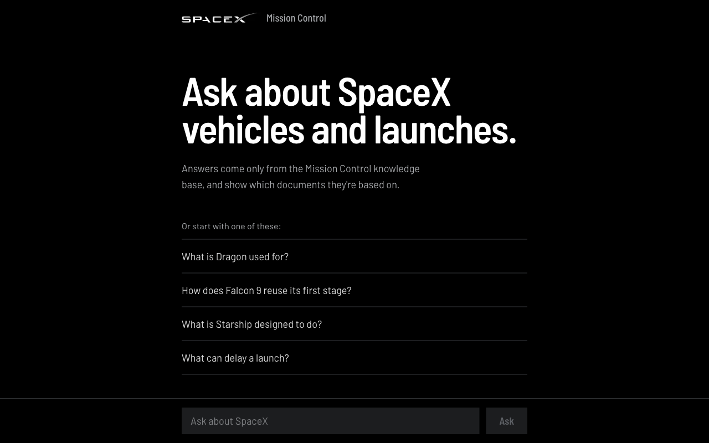
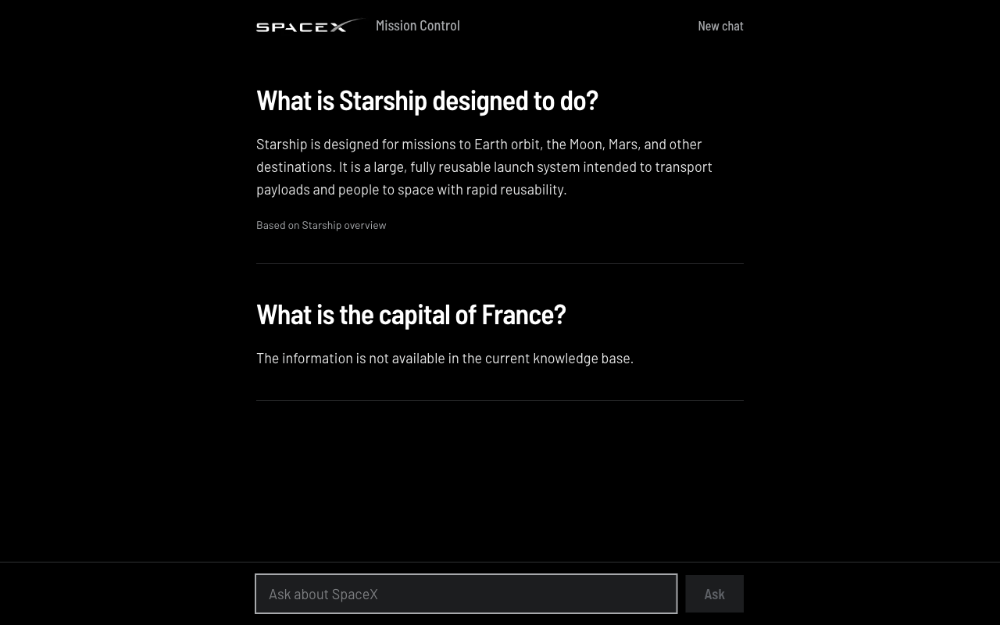
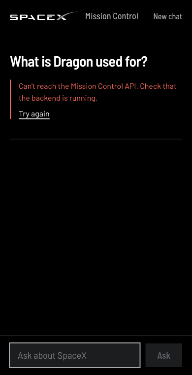

# SpaceXBot: Mission Control Knowledge Assistant

> **A SpaceX chatbot that answers only from its own knowledge base, and shows the documents each answer is based on.**

SpaceXBot ("Mission Control") is a retrieval-augmented generation (RAG) assistant. SpaceX documents
are stored in Azure Blob Storage, split into chunks, embedded with OpenAI, and indexed in Pinecone.
When you ask a question, the backend finds the most relevant chunks and has OpenAI write an answer
from them. If the knowledge base doesn't cover the question, it says so instead of guessing.

[](https://www.python.org/)
[](https://fastapi.tiangolo.com/)
[](https://nextjs.org/)
[](https://react.dev/)
[](https://www.typescriptlang.org/)
[](https://tailwindcss.com/)
[](https://www.pinecone.io/)

---

## 🎯 Key Features

### Grounded Answers
- **Knowledge-base only**: answers are written from retrieved document chunks, never from the model's general knowledge
- **Honest fallback**: off-topic questions get "The information is not available in the current knowledge base."
- **Source citations**: each answer lists the documents it was based on; loosely related matches are hidden

### Knowledge Base Ingestion
- **Azure Blob Storage source**: documents are read from the `spacex` container using your `az login`
- **Metadata-aware**: each document's header (`title`, `category`, `vehicle`) is stored with its vectors
- **Safe to re-run**: stable vector IDs mean re-ingesting overwrites entries instead of duplicating them
- **Dry-run mode**: preview exactly what would be uploaded without writing anything

### Chat Interface
- **Conversation log**: each question is shown as a heading with its answer below; "New chat" starts over
- **Suggested questions** drawn from the documents in the knowledge base
- **Clear states**: "Searching the knowledge base…" while loading; a specific error with "Try again" if the backend is unreachable
- **Keyboard friendly**: Enter to send, Shift+Enter for a new line, visible focus, respects reduced-motion settings
- **Responsive** from phone to desktop

### Reliable API
- **Input validation**: blank questions and questions over 1,000 characters are rejected (422)
- **Readable failures**: OpenAI or Pinecone outages return a 502 with a plain message, and details are logged server-side
- **Starts without keys**: service clients are created on first use, so the app and its tests run without credentials

---

## 📸 Screenshots

### Home


*Start by typing a question or picking one of the suggestions.*

### Answers with Sources


*A grounded answer listing its source document, and an off-topic question answered honestly with no sources.*

### Backend Unreachable (Mobile)


*If the API can't be reached, the page says what's wrong and offers a retry.*

---

## 🏗️ Architecture

### Technology Stack

**Backend**
- **FastAPI**: REST API with automatic OpenAPI docs
- **Python 3.10+**: tested on 3.12
- **OpenAI**: `text-embedding-3-small` for embeddings, `gpt-5.4-mini` for answers (configurable)
- **Pinecone**: serverless vector index `spacex-rag` (1536 dimensions, cosine, AWS us-east-1)
- **Azure Blob Storage**: source documents (`spacexdocuments` account, `spacex` container)
- **Pytest**: 15 tests, no keys or network needed

**Frontend**
- **Next.js 16**: App Router with Turbopack
- **React 19** + **TypeScript**
- **Tailwind CSS 4**: palette taken from the SpaceX logo (black, white, silver)
- **Barlow / Barlow Semi Condensed**: via `next/font`

### System Architecture

```
┌──────────────────────────────────────────────┐
│             Chat Interface                   │
│    Next.js 16 · React 19 · Tailwind 4        │
│            http://localhost:3000             │
└──────────────────────────────────────────────┘
                       ↓  POST /chat
┌──────────────────────────────────────────────┐
│               FastAPI Backend                │
│   Validation · Error handling · CORS         │
│            http://127.0.0.1:8000             │
└──────────────────────────────────────────────┘
          ↓ embed question         ↓ top 3 chunks + question
┌─────────────────────┐   ┌────────────────────────────┐
│  Pinecone           │   │  OpenAI                    │
│  spacex-rag index   │   │  gpt-5.4-mini answer       │
└─────────────────────┘   └────────────────────────────┘
          ↑ upsert vectors
┌──────────────────────────────────────────────┐
│     Ingestion (python -m app.ingest)         │
│  Azure Blob → extract → chunk → embed        │
└──────────────────────────────────────────────┘
```

---

## 🚀 Quick Start

### Prerequisites
- Node.js 20.9+ and Python 3.10+
- OpenAI API key (with access to `gpt-5.4-mini` and `text-embedding-3-small`)
- Pinecone API key
- For loading documents only: Azure CLI (`az login`) with the **Storage Blob Data Reader** role on `spacexdocuments`

### 1. Clone and Configure

```bash
git clone https://github.com/smattaparthy/SpaceXBot.git
cd SpaceXBot

cp backend/.env.example backend/.env
# Edit backend/.env and set OPENAI_API_KEY and PINECONE_API_KEY
```

`backend/.env` is gitignored. All settings are listed under **Configuration** below.

### 2. Start the Backend

```bash
cd backend
python3 -m venv .venv && source .venv/bin/activate
pip install -r requirements.txt
uvicorn app.main:app --reload --port 8000
```

### 3. Start the Frontend

In a second terminal, from the repo root:

```bash
npm install
npm run dev
```

### 4. Access the Application

- **Chat**: http://localhost:3000
- **Backend API**: http://127.0.0.1:8000
- **API docs (Swagger)**: http://127.0.0.1:8000/docs
- **API docs (ReDoc)**: http://127.0.0.1:8000/redoc

### 5. Ask Your First Question

1. Open http://localhost:3000
2. Pick a suggestion, or type a question such as *"How does Falcon 9 reuse its first stage?"*
3. Read the answer and the source documents listed below it
4. Try something off-topic to see the "not available" response

---

## 📚 Knowledge Base

### Current Documents

The `spacex` container currently holds five short **synthetic demo documents**, one vector each:

| Document | Category | Vehicle |
|----------|----------|---------|
| `company_overview.txt` | company | - |
| `dragon_overview.txt` | vehicle | Dragon |
| `falcon9_overview.txt` | vehicle | Falcon 9 |
| `launch_operations.txt` | operations | - |
| `starship_overview.txt` | vehicle | Starship |

### Adding Documents

Upload `.txt` or `.md` files to the `spacex` container. Start each file with a `key: value` header,
then a blank line, then the body:

```text
document_id: spacex-dragon-001
title: Dragon Spacecraft Overview
category: vehicle
vehicle: Dragon

Dragon is a SpaceX spacecraft family designed to transport cargo and people...
```

Then load them into Pinecone from `backend/`:

```bash
python -m app.ingest --dry-run   # preview: lists documents, chunks, and metadata; writes nothing
python -m app.ingest             # embed and upsert into Pinecone
```

Other file types (such as `.zip`) are skipped. PDF support isn't built yet.

---

## 📁 Project Structure

```
SpaceXBot/
├── app/                              # Next.js frontend
│   ├── components/
│   │   ├── ChatWidget.tsx            # Chat: history, loading/error states, sources
│   │   └── NavBar.tsx                # Logo header with "New chat"
│   ├── globals.css                   # Tailwind import and theme (colors, fonts, motion)
│   ├── layout.tsx                    # Fonts and page metadata
│   └── page.tsx                      # Home page
├── backend/                          # FastAPI backend
│   ├── app/
│   │   ├── __init__.py               # Loads backend/.env
│   │   ├── main.py                   # API: GET /, POST /chat
│   │   ├── config.py                 # Settings (models, index name, top-k)
│   │   ├── clients.py                # OpenAI and Pinecone clients, created on first use
│   │   ├── ingest.py                 # Azure Blob → Pinecone ingestion CLI
│   │   └── services/
│   │       ├── blob_service.py       # Azure Blob access (az login / managed identity)
│   │       ├── document_extractor.py # Text decoding and header parsing
│   │       ├── text_processor.py     # Cleaning and chunking
│   │       ├── embedding_service.py  # OpenAI embeddings
│   │       ├── retrieval_service.py  # Pinecone similarity search
│   │       ├── openai_chat_service.py# Answer generation
│   │       ├── pinecone_service.py   # Vector upserts
│   │       └── create_pinecone_index.py  # One-time index creation
│   ├── tests/                        # Pytest suite
│   ├── requirements.txt
│   └── .env.example                  # Settings template
├── docs/
│   ├── PLAN.md                       # Build plan, current state, known issues
│   └── screenshots/
└── public/images/spaceXLogo.webp
```

---

## 🔧 Development

### Backend Development

```bash
cd backend
source .venv/bin/activate
uvicorn app.main:app --reload --port 8000
```

### Frontend Development

```bash
npm run dev      # development server with hot reload
npm run build    # production build
npm run start    # serve the production build
```

### Running Tests and Checks

```bash
# Backend: API behavior with faked OpenAI/Pinecone calls, plus document parsing
cd backend && python -m pytest tests

# Frontend: type-check and lint
npx tsc --noEmit
npm run lint
```

The backend tests need no API keys or network access.

---

## ⚙️ Configuration

Backend settings go in `backend/.env`:

| Variable | Required | Default | Description |
|----------|----------|---------|-------------|
| `OPENAI_API_KEY` | Yes | - | OpenAI API key |
| `PINECONE_API_KEY` | Yes | - | Pinecone API key |
| `PINECONE_INDEX_NAME` | No | `spacex-rag` | Pinecone index to query and write to |
| `OPENAI_CHAT_MODEL` | No | `gpt-5.4-mini` | Model that writes answers (`gpt-5.4-nano` also works) |
| `RETRIEVAL_TOP_K` | No | `3` | Number of chunks retrieved per question |

The browser never calls the backend directly. It sends requests to `/api/*` on the frontend's own
address, and Next.js forwards them to the backend (see `next.config.ts`). This lets the chat work
from phones and other machines on your network. To point it at a backend other than
`http://127.0.0.1:8000`, set `BACKEND_URL` in the environment or `.env.local` before running
`npm run dev` or `npm run build`.

The embedding model is fixed to `text-embedding-3-small`, because stored vectors must match it.
Changing it means re-running ingestion into a new index.

---

## 📊 API Endpoints

### `GET /`
Health check. Returns `{"message": "Mission Control RAG API is running"}`.

### `POST /chat`
Ask a question.

**Request**
```json
{ "question": "What is Dragon?" }
```

**Response `200`**
```json
{
  "question": "What is Dragon?",
  "answer": "Dragon is a SpaceX spacecraft family designed to transport cargo and people to and from low Earth orbit...",
  "sources": [
    { "file_name": "dragon_overview.txt", "chunk_id": 0, "score": 0.573 },
    { "file_name": "falcon9_overview.txt", "chunk_id": 0, "score": 0.282 },
    { "file_name": "company_overview.txt", "chunk_id": 0, "score": 0.266 }
  ]
}
```

`sources` always contains the top matches with their similarity scores. The chat interface only
displays the relevant ones.

**Errors**
| Status | When |
|--------|------|
| `422` | Question is missing, blank, or over 1,000 characters |
| `502` | Pinecone or OpenAI failed: `"Could not search the knowledge base. Please try again."` or `"Could not generate an answer. Please try again."` |

**Interactive documentation**: http://127.0.0.1:8000/docs

---

## 🔐 Security

- **Secrets stay local**: API keys live in `backend/.env`, which is gitignored; only the empty `.env.example` template is committed
- **Least-privilege storage access**: ingestion only needs **Storage Blob Data Reader**; anonymous blob access is disabled on the storage account
- **No service-principal secrets**: blob access deliberately ignores `AZURE_CLIENT_ID` / `AZURE_CLIENT_SECRET` from the environment and uses `az login` locally or managed identity when deployed
- **Input validation**: Pydantic enforces question length; error responses never expose upstream error details
- **Same-origin requests**: the browser only talks to the frontend, which forwards `/api/*` to the backend; the backend's CORS rules additionally allow only `localhost:3000` / `127.0.0.1:3000`
- **No user accounts**: the demo has no authentication, so don't expose the API publicly without adding it

---

## 🚢 Deployment

Not deployed yet. This is Phase 5 in [docs/PLAN.md](docs/PLAN.md).

### Checklist
- [ ] Dockerfile for the backend
- [ ] Host the backend (e.g. Azure Container Apps) with a managed identity that has Storage Blob Data Reader
- [ ] Host the frontend (Vercel or Azure Static Web Apps) and build it with `BACKEND_URL` pointing at the backend
- [ ] Store API keys in the platform's secret store, not in files
- [ ] Add rate limiting before making the API public

### Planned Architecture

```
Browser
   ↓
Frontend (Vercel / Azure Static Web Apps)
   ↓ HTTPS
Backend (Azure Container Apps, managed identity)
   ↓                    ↓                 ↓
Pinecone          OpenAI API       Azure Blob (ingestion)
```

---

## 🐛 Troubleshooting

**"Can't reach the Mission Control API. Check that the backend is running."**
```bash
# The backend isn't running, or is on a different port
cd backend && source .venv/bin/activate && uvicorn app.main:app --reload --port 8000
# If it runs elsewhere, set BACKEND_URL (e.g. BACKEND_URL=http://127.0.0.1:9000) and restart the frontend
```

**Buttons do nothing when opening the dev server from a phone or another machine**
```bash
# Next.js 16 blocks dev-server scripts for unknown hostnames. Private network addresses
# (10.x, 172.x, 192.168.x) and *.local are allowed in next.config.ts (allowedDevOrigins);
# add yours there if you use a different hostname, then restart `npm run dev`
```

**"Could not search the knowledge base" / "Could not generate an answer" (502)**
```bash
# Check the backend terminal for the logged error. Usually one of:
# - OPENAI_API_KEY or PINECONE_API_KEY missing or invalid in backend/.env
# - OPENAI_CHAT_MODEL set to a model your key can't use
# - PINECONE_INDEX_NAME doesn't match an existing index
```

**Ingestion fails with `AuthorizationPermissionMismatch`**
```bash
# Your Azure account lacks the data-access role (Owner/Contributor aren't enough)
az role assignment create --assignee <you@domain> --role "Storage Blob Data Reader" \
  --scope $(az storage account show -n spacexdocuments --query id -o tsv)
# New roles can take a few minutes to take effect
```

**Ingestion fails with `DefaultAzureCredential failed to retrieve a token`**
```bash
az login   # sign in to the tenant that owns the spacexdocuments account
```

**Every answer says the information isn't available**
```bash
# The index is empty or you're pointing at the wrong one
cd backend && python -m app.ingest --dry-run   # confirm documents are found
python -m app.ingest                           # load them
```

---

## 📈 Roadmap

Progress is tracked in [docs/PLAN.md](docs/PLAN.md):

- [x] **Phase 1**: make it runnable (settings template, dependencies, repo cleanup)
- [x] **Phase 2**: reproducible ingestion pipeline from Azure Blob Storage
- [x] **Phase 3**: backend reliability (validation, error handling, tests)
- [x] **Phase 4**: chat interface
- [ ] **Phase 5**: deployment
- [ ] Optional: stream answers as they're written, PDF ingestion, overlapping chunks for longer documents

---

## 🤝 Contributing

### Development Workflow

1. **Create a feature branch** from `main`:
   ```bash
   git checkout -b feat/your-change
   ```
2. **Make your change** and run the checks:
   ```bash
   cd backend && python -m pytest tests && cd ..
   npx tsc --noEmit && npm run lint && npm run build
   ```
3. **Commit** using [Conventional Commits](https://www.conventionalcommits.org/) (`feat:`, `fix:`, `docs:`, `chore:`...)
4. **Open a pull request** against `main`

### Code Style

**Python**
- Type hints on new code, f-strings, `pathlib` over `os.path`
- Services read settings from `app/config.py` and clients from `app/clients.py`
- Tests go in `backend/tests/` and must not call real services

**TypeScript/React**
- Strict TypeScript, typed props with interfaces
- Tailwind utility classes using the theme colors in `app/globals.css`
- This project uses Next.js 16: check `node_modules/next/dist/docs/` before relying on older APIs

---

## 📄 License and Disclaimer

No license has been chosen yet. All rights reserved by the authors until one is added.

**Disclaimer**: This is an independent educational project and is **not affiliated with, endorsed by, or
sponsored by SpaceX**. The SpaceX name and logo are trademarks of Space Exploration Technologies Corp.
The knowledge base contains synthetic demo documents, so don't rely on the answers as authoritative
information.

---

## 🙏 Acknowledgments

- **FastAPI**: Python API framework
- **Next.js** and **React**: frontend framework
- **OpenAI**: embeddings and answer generation
- **Pinecone**: vector search
- **Microsoft Azure**: document storage
- **Tailwind CSS**: styling
- **Barlow** typeface by Jeremy Tribby
